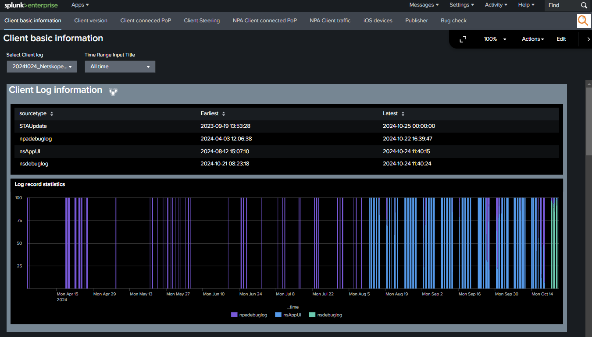
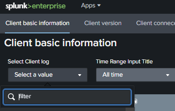

# About Netskope Log Analyzer



We have received feedback that Netskope logs are written for developers, making it difficult for users and partners supporting them to understand the situation.
To address this, we provide a clear visualization of key information, such as configured settings, which PoP the client connected to, and how traffic was handled, using graphs and tables.
We hope this will be helpful for troubleshooting.

## Getting Started

This add-on has been confirmed to work on both Linux and Mac.
When running it on a Mac, please download the Intel version of the Splunk installer and run it using Rosetta. Follow the installation instructions provided by macOS and Splunk.

### Note:

This add-on creates the following indexes and stores log data in them.
We recommend setting up and using a separate Splunk server from the production environment.

* netskope_client1
* netskope_json1
* netskope_publisher1
* netskope_csv1

 1. Please create a folder at the following location. Splunk will monitor this folder and start indexing logs as soon as it detects client log folder.

    ```sh
    mkdir -p  /var/log/splunk/logs
    chmod 777 /var/log/splunk/logs
    ```

 2. Place the Add-on folder in the Splunk apps directory.

    ```sh
    cd /opt/splunk/etc/apps/
    git clone https://github.com/netskopeoss/netskope_log_analyzer.git
    ```

 3. Extract the Netskope log bundle and upload it to /var/log/splunk/logs. Splunk will detect the logs and start indexing them.
    

 4. Access the dashboard(http://<IP address>:8000/en-GB/app/netskope_log_analyzer/) and select the log folder name from the dropdown menu.
    The data will be displayed on the dashboard.Tabs are organized by functionality. Open each tab in a new browser tab and repeat the steps above.

    
